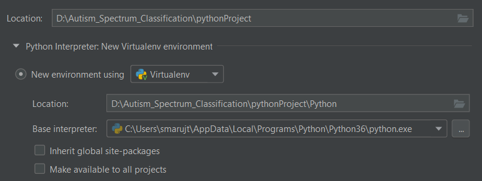
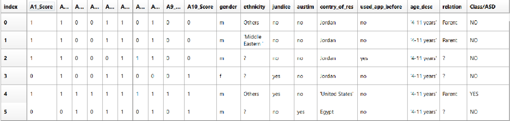
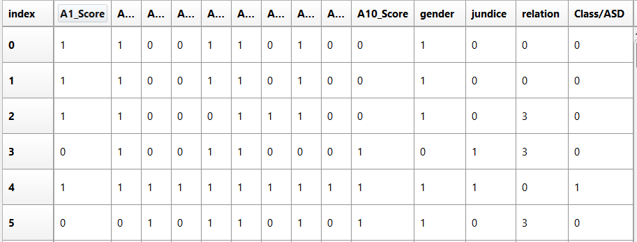

# Autism-spectrum-classification

## 1. The aim of the project
The project task was to implement a model in the python language for predicting the autism spectrum in children. Data from the website were used for this task:
https://archive.ics.uci.edu/ml/datasets/Autistic+Spectrum+Disorder+Screening+Data+for+Children++
The dataset used had a total of 292 different patient outcomes for 19 variables. Based on the knowledge of machine learning and neural networks, it was necessary to prepare the data, and then create and learn a model and test it on unused data. 

## 2. Libraries used
For the python 3.6 interpreter:
* scipy - for importing data from a file,
* numpy - for mathematical operations on columns,
* pandas - for storing and processing data in tables,
* pandasgui - to display results in tables,
* tensorflow and keras - libraries used for machine learning,
* sklearn - data processing and creation of performance metrics.

__Note:__ The versions of individual libraries can be found in the requirements.txt file 


## 3. Setup environment
### a) with Anaconda
Anaconda is a great program for creating virtual environments. It makes it much easier to work with different projects and versions of libraries. To run this project, it is recommended to create a new environment and follow the methods given below:
We run the anaconda-promt program. Once in the (base) environment, enter the commands as below:

Create a conda environment 
```
conda create -n robmed-env
```

Activation of environment
```
conda activate robmed-env
```

Installing libraries (go to the directory where the project folder is located): 
```
conda install --file requirements.txt
```

Launch the script
```
python main.py
```

If the script was successfully run, the model training process will start. There will also be a table showing how the model performed on the test data. In addition, in the folder in the Models directory there will be a ready trained model.

**Note:** If you used a terminal and would like to display the data in the pandasgui tables (commented out by default), you may run into an error. So it is recommended to use programs like Pycharm or Spyder when we want to use this library and edit the code.

### b) using Pycharm
We launch Pycharm and create a new project.
We choose the base python interpreter. It is important that this is the python 3.6 version.
Additionally, we create a new virtual environment (if you have already completed the step with creating the conda environment, we can use it here).



We move the contents of the Autism_Classification folder to the project folder and open the main.py file.
To install the libraries we open a terminal and then use the command: 

```
pip install -r requirements.txt
```

At this point, we can already run the program in the pycharm environment. 

## 4. Code overview
### a) Data preparation
The data retrieved from the page is located in the dataset folder in the Autism-Child-Data.arff file. Therefore, they should be transferred to the program variables. The scipy library and the arff.loadarff method were used to load the data.
After loading the data, you had to use the pandas library and decode the data to the utf-8 format. Below is a table of already loaded variables. 



In order to create a network and to best learn a model, important data must be properly processed and unnecessary columns should be removed.

Removed columns:
* Age group - it was exactly the same for all children. The variable could be used for a larger database of different age groups. However, this information was useless for this problem.
* Country of residence, nationality, application used - when training the model, it turned out that these parameters did not affect the learning outcomes. The effects of these variables were investigated, but their use could only worsen the results.
* Autism - this column has also been removed because this parameter is our value that we want to predict. So it had to be placed in a different buffer.

Processed columns:
* Gender, jaundice, ASD - men / woman and yes / no values have been changed to 1 and 0,
* Relatives - values changed to Parent - 0, self - 1,
Health Care profesional -2,? - 3.

The finished data set for the student was divided as follows:
Total data size: 292
Train data size: 183
Valid data size: 21
Data size test: 88
Prepared table of variables for learning. 




